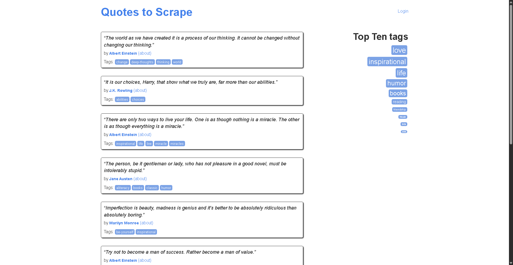

# 🕷️ AI Web Scrapper

[](https://ai-web-scrapper-gorl.onrender.com)
[](https://www.python.org/)
[](https://streamlit.io/)

An **AI‑assisted, GUI‑based** web‑scraper that combines **Selenium**, **BeautifulSoup**, and **OpenAI GPT‑4** to pull structured data from almost any website.  
It mimics natural browsing behaviour with **undetected‑chromedriver**, funnels the raw HTML through a lightweight LLM prompt, and delivers tidy CSV output – all wrapped in a one‑page Streamlit app.

---

## ✨ Key Features

| Capability | Details |
|------------|---------|
| 🚗 **Stealth Scraping** | Launches a headless Chrome via `undetected‑chromedriver` to reduce bot‑detection. |
| 🧠 **LLM‑Powered Parsing** | Uses an OpenAI completion to *extract only the fields you describe* and returns valid CSV. |
| 🖥️ **Streamlit UI** | One‑click “Scrape → Parse → Download” workflow – perfect for non‑coders. |
| 📸 **Automatic Screenshot** | Saves a full‑page PNG every time a page is scraped. |
| ☁️ **Ready for Render** | Ships with a working Render deployment (see live demo above). |

---

## 🚀 Quick Start (Local)

1. **Clone & move inside the repo**

```bash
git clone https://github.com/bhavin2004/ai-web-scrapper.git
cd ai-web-scrapper
```

2. **Create a virtual env & install deps**

```bash
python -m venv venv && source venv/bin/activate   # Windows: venv\Scripts\activate
pip install -r requirements.txt
```

3. **Add your OpenAI / GitHub token**

Create a `.env` file in the project root:

```dotenv
GITHUB_TOKEN=sk‑your‑token‑here
```

The token is used for authenticated calls to the hosted GPT‑4 endpoint inside `parse.py`.

4. **Run the app**

```bash
streamlit run main.py
```

Open the printed local URL (usually http://localhost:8501) in your browser.

---

## 🖼️ Demo Screenshot

<p align="center">
  
</p>

---

## 🏗️ Project Layout

```
.
├── main.py           # Streamlit front‑end (UI + workflow)
├── scrape.py         # Selenium scraping helpers
├── parse.py          # GPT‑powered parser → CSV
├── requirements.txt  # Python dependencies
├── .gitignore        # Useful exclusions
└── screenshot.png    # Example output image
```

---

## ⚙️ How It Works

1. **Scrape** – `scrape_website()` opens the target URL, stores `page_source`, and saves a screenshot.  
2. **Clean** – The `<body>` is stripped of script/style tags; text is normalised.  
3. **Chunk** – Large DOMs are split into ~6 kB segments for the model.  
4. **Parse** – Each chunk is sent to GPT‑4 with a strict *“CSV‑only”* system prompt.  
5. **Merge & Download** – Headers are deduplicated, rows concatenated, a CSV is streamed back to the user.

---

## 🌐 One‑Click Deploy on Render

Create a new **Web Service** on [Render](https://render.com):

| Setting | Value |
|---------|-------|
| **Build Command** | `pip install -r requirements.txt` |
| **Start Command** | `streamlit run main.py --server.port $PORT --server.address 0.0.0.0` |
| **Instance Type** | Starter instance (free tier) |

Ephemeral storage means the CSV is available to download in‑session only – integrate Google Drive or S3 if you need persistence.

---

## 🛣️ Roadmap

- [ ] Multi‑site scraping presets  
- [ ] Proxy rotation & human‑like mouse movement  
- [ ] Streamlit Cloud deployment  
- [ ] Unit tests (pytest + CI)

---

## 🤝 Contributing

Pull requests are welcome! Please open an issue first to discuss major changes.

1. Fork the repo & create a feature branch (`git checkout -b feat/my-feature`)  
2. Commit your changes (`git commit -am 'Add amazing feature'`)  
3. Push to the branch (`git push origin feat/my-feature`)  
4. Open a PR ✨

---

## 📝 License

This project is released under the **MIT License** – see [`LICENSE`](LICENSE) for details.

---

## 📬 Contact

**Bhavin Karangia** – reach me on [LinkedIn](https://www.linkedin.com/in/bhavin-karangia)  
If you use this project, I’d love to hear about it!
